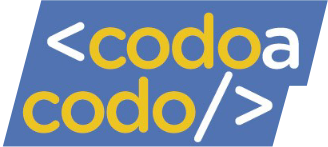

<h1 align="center">Funko Shop</h1>

  

Challenge integrador, desarrollo web de una tienda para Funko y merchandising.

## 📝 Tabla de Contenidos

- [Información](#about)
- [Herramientas Utilizadas](#built_using)

## 🧐 Información 

### Introducción
Challenge integrador de Codo a codo. El objetivo de este proyecto es contar con un espacio autodidacta y auto gestionado que le permita al estudiante consolidar el proceso de aprendizaje de los temas vistos a lo largo de la cursada a través de la práctica con un fin común y particular. 
Es individual y no reviste carácter obligatorio, sin embargo se recomienda llevarlo adelante ya que se encuentra pensado para ir aplicando los conocimientos aprendidos en cada etapa del programa.

### Consigna
Desarrollar una tienda en línea de las conocidas figuras coleccionables Funko y merchandising adicional, como remeras, llaveros y mucho más. 
El sitio consta de 2 partes fundamentales, en primer lugar la tienda en línea donde los clientes podrán ver todos los productos disponibles, conocer su precio, stock y características. Además podrán registrarse para agregar sus productos favoritos al carrito y ver el subtotal que deben pagar. 
En segundo lugar, se necesita contar con las vistas necesarias para administrar la tienda (admin o backoffice), ver el listado de productos cargados y su stock, poder agregar, editar y eliminar items y sus propiedades y que esos cambios se reflejen en tiempo real de cara al cliente.

### Alcance
Dentro del alcance de este proyecto se fomenta la interacción y ayuda entre pares como focos de consulta a fin de potenciarse como equipo durante todo su desarrollo.

## ⛏️ Herramientas Utilizadas 

- [FIGMA](https://www.figma.com/) - Web Design
- [Bootstrap](https://getbootstrap.com/) - Web Framework
- [NodeJS](https://nodejs.org/en/) - Server Environment
- [ExpressJs](https://expressjs.com/) - Server Framework
- [MySQL](https://www.mysql.com/) - Database
- [NPM](https://www.npmjs.com/) - Package Manager
